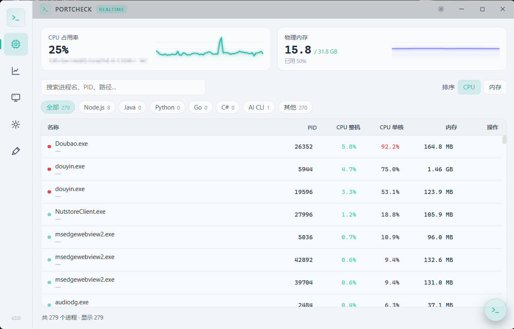
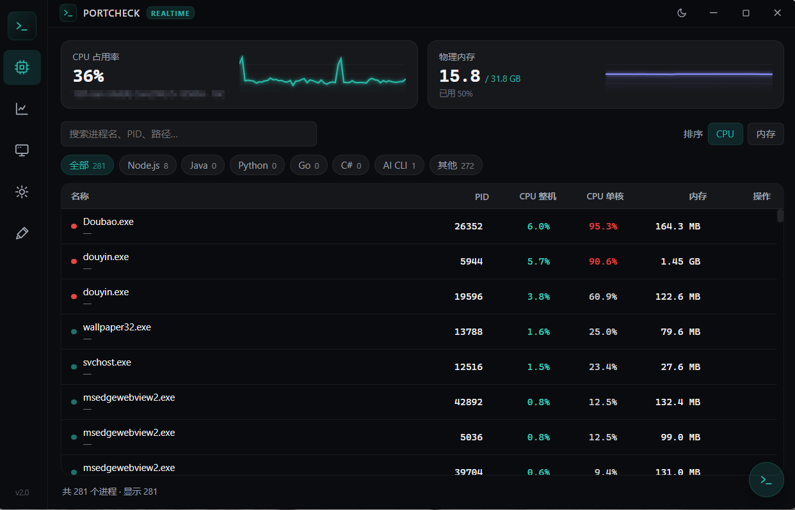
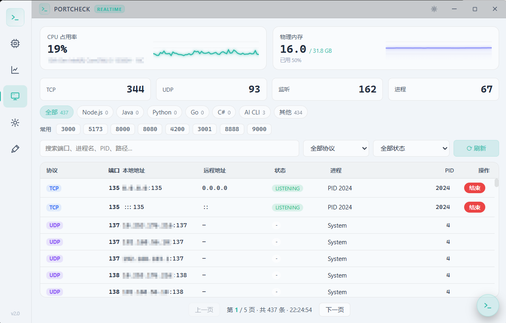
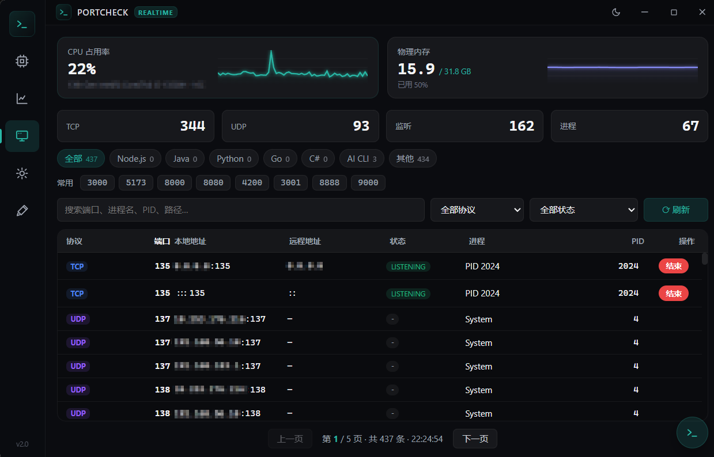

# PortCheck

[](https://go.dev)
[](https://v3.wails.io)
[](https://vuejs.org)
[](https://www.typescriptlang.org)
[](#)
[](https://github.com/Sxuan-Coder/PortCheck/releases/latest)

PortCheck 是一款面向 Windows 的**轻量任务管理工具**，聚焦日常系统维护与开发者本地排查场景：进程、性能、端口、服务、启动项一览，提供更直接的查看与操作体验。

> 本地服务端口被谁占了？Codex / cc 帮你开了一堆后台开发服务器没关？一眼看清 Node.js、Java、Python、Go 进程，确认后即可结束。

## ✨ v2.0 重大更新

v2.0 从单一的端口查看器升级为完整的任务管理器，并全面重构为高性能架构：

- **进程管理**：查看、搜索、筛选、按 CPU/内存排序，确认后结束进程（虚拟滚动，1000+ 进程 60fps）
- **性能监控**：实时 CPU / 内存占用，CPU
- **端口查看**（核心能力）：TCP/UDP、本地/远程地址、状态、PID、进程名与路径，多维搜索筛选
- **服务管理**：所有 Windows 服务，支持确认后停止/启动
- **启动项管理**：开机启动项，支持确认后禁用/启用/删除
- **速启指令**：右下角悬浮终端，支持 `kill <PID>`、`theme`、`help`
- **系统托盘**：关闭即最小化到托盘常驻，双击唤回
- **主题切换**：暗色（默认）/ 亮色，本地持久化
- **极致轻量**：纯 CSS + 内联 SVG 图标，无 Tailwind / 无 UI 组件库；后端单 ticker 批量事件推送，构建产物约 9MB

## 🖼️ 截图

<table>
  <tr>
    <td width="50%" align="center"><b>亮色主题</b></td>
    <td width="50%" align="center"><b>暗色主题</b></td>
  </tr>
  <tr>
    <td width="50%"></td>
    <td width="50%"></td>
  </tr>
  <tr>
    <td width="50%"></td>
    <td width="50%"></td>
  </tr>
</table>

## 下载

不用自己编译，直接到 [Releases](https://github.com/Sxuan-Coder/PortCheck/releases/latest) 下载最新版即可：

- `PortCheck-<版本号>-windows-amd64-installer.exe`：NSIS 安装包（推荐，自动安装并创建快捷方式）
- `PortCheck-<版本号>-windows-amd64.zip`：免安装压缩包，解压即用
- `PortCheck-<版本号>-windows-amd64.exe`：单文件可执行程序

> 首次运行若被 Windows SmartScreen 拦截，点击「更多信息 → 仍要运行」即可。

## 功能

- **进程**：实时 CPU / 内存占用，按名称 / PID / 路径搜索，类型筛选（Node.js / Java / Python / Go / C# / AI CLI），按 CPU 或内存排序，确认后结束进程。
- **性能**：整机 CPU 占用率与历史曲线、物理内存使用率、CPU 型号与核心数、端口连接概览。
- **端口**：本机 TCP / UDP 端口，含本地地址、远程地址、TCP 状态、PID、进程名与进程路径；按端口 / 进程名 / PID / 地址 / 路径搜索；按协议与状态筛选；按进程类型筛选；确认后结束占用端口的进程。
- **服务**：枚举所有 Windows 服务的名称、显示名、状态、类型；确认后可停止/启动（关键服务受保护，权限不足时按需 UAC 提权）。
- **启动项**：枚举开机启动程序的名称、命令、来源与启用/禁用状态；确认后可禁用/启用/删除（HKLM 等需管理员时按需 UAC 提权）。
- **速启指令 / 系统托盘 / 明暗主题**。

## 安全说明

PortCheck 里的「结束进程 / 停止服务 / 删除启动项」属于危险操作：

- 结束进程会结束占用端口/资源的整个进程，不是关闭单个连接。
- 停止服务可能导致系统或应用功能异常；关键系统服务在后端被保护名单拦截。
- 删除启动项不可恢复，若只想取消开机自启请优先使用「禁用」。

基础保护：

- 不允许结束 PID `0` / PID `4` / PortCheck 自身进程。
- 每次危险操作前都会弹出确认框。
- 用户态可写操作直接执行；权限不足时按需弹出 UAC 提权，不强制全程管理员运行。

有些系统进程或受保护服务即使确认后仍可能因权限/策略失败，这是正常情况。

## 环境要求

当前项目主要在 Windows 上验证。

- Windows 10 / Windows 11
- Go 1.25 或更新版本
- Node.js 24 或更新版本
- npm 11 或更新版本
- Wails v3 CLI

安装 Wails v3 CLI 后，可以先检查版本：

```powershell
wails3 version
```

## 本地运行

```powershell
git clone https://github.com/Sxuan-Coder/PortCheck.git
cd PortCheck

cd frontend
npm install
cd ..

wails3 dev
```

## 打包

```powershell
wails3 task build
```

Windows 下默认产物在：

```text
bin/PortCheck.exe
```

## 测试

```powershell
cd frontend
npm install
npm run build
cd ..

go test ./...
```

这里先构建前端，是因为 Go 入口里会通过 `embed` 打包 `frontend/dist`。

## 项目结构

```text
.
├── main.go                     # Wails 入口：无边框窗口 + 系统托盘 + 服务注册
├── models.go                   # 进程/性能/服务/启动项共享模型
├── portservice_windows.go      # Windows 端口查询与结束进程
├── portservice_other.go        # 非 Windows 占位实现
├── processinfo_windows.go      # 进程名/路径查询助手（端口与进程采样共用）
├── monitor.go / monitor_*.go   # MonitorService：1s 批量事件推送（进程+性能+端口统计）
├── services_windows.go         # Windows 服务只读枚举
├── startup_windows.go          # 启动项只读枚举
├── frontend/                   # Vue3 + 纯 CSS 前端
│   ├── src/tabs/               # 进程/性能/端口/服务/启动项 五个视图
│   ├── src/components/         # 标题栏/侧栏/迷你图/速启/Toast
│   └── src/composables/        # monitor/theme/toast/虚拟滚动
├── build/                      # Wails 构建配置与图标
└── Taskfile.yml                # Wails 任务入口
```

## 致谢

- 感谢[fengfengzhidao/port_lite](https://github.com/fengfengzhidao/port_lite)
